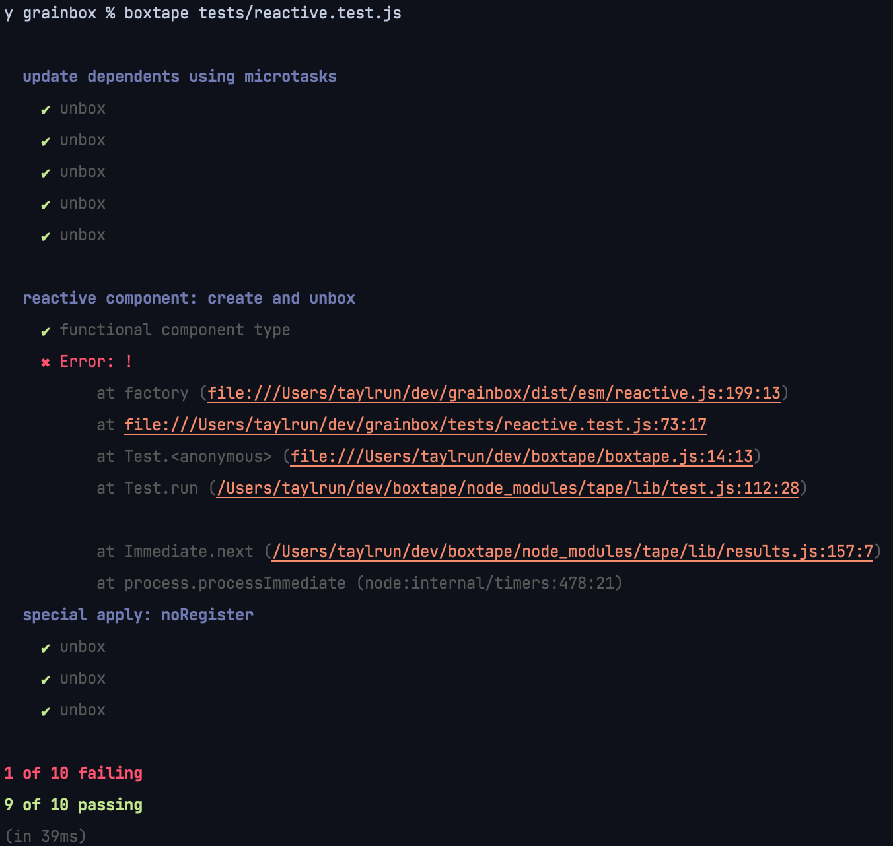

# 📦 boxtape

This is just regular tape, but with some quality of life improvements.

## Usage

See [tape](https://www.npmjs.com/package/tape).

```shell
boxtape tests/**/*.js
```

```js
import test from 'boxtape'
```

## Additions

### `beforeEach`

```js
import test from 'boxtape'

test.beforeEach(async (t) => {
  // Do something before each test.
})
```

### `afterEach`

```js
import test from 'boxtape'

test.afterEach(async (t) => {
  // Do something after each test.
})
```

### Default TAP Output Formatter

This uses a fork of [`tap-pretty`](https://www.npmjs.com/package/tap-pretty) to provide a nice output by default. The fork has added error stack trace so that you can navigate to where the error occurred.



Since `boxtape` automatically pipes `tape` output into `tap-pretty`, you cannot pipe into your own tap formatter. 

## Examples

### Frontend Testing 

Here is a simple example to get you started for frontend testing.

```js
// In this example, we are doing some frontend testing.
import test from 'boxtape'
import sinon from 'sinon'
import {JSDOM} from 'jsdom'

// Load DOM functions:
const dom = new JSDOM()
global.document = dom.window.document
global.window = dom.window

sinon.spy(document)

test.beforeEach(() => {
  // Maybe you want to reset your spy counts:
  for (const method in document) {
    if (typeof document[method] === 'function') {
      if (document[method].callCount !== undefined) {
        document[method].callCount = 0
      }
    }
  }
})
```